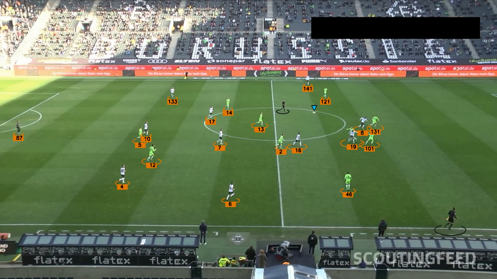

# Football Analysis Project

This project aims to detect and track players, referees, and the football in match footage using a YOLO-based object detection model. A custom model has been trained for these classes and can be used for frame-by-frame analysis of match videos.

At this stage, the project is focused solely on detection. Additional features such as team classification via jersey color clustering, ball possession estimation, optical flow for camera motion, perspective transformation, and player movement/speed analysis may be explored in future iterations.

## Models

The trained YOLO model supports detection of the following classes:
- player
- referee
- ball

Model weights are not included in the repository. To use the model, first run the training notebook to download the dataset and train locally, or provide your own trained weights in the `models/` directory.
